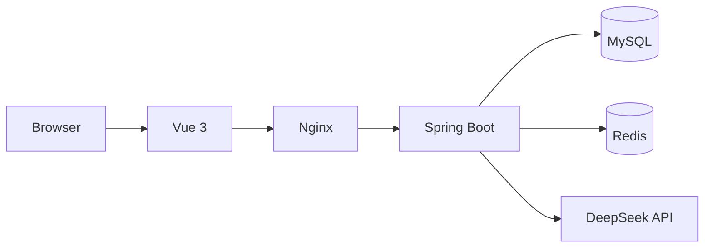
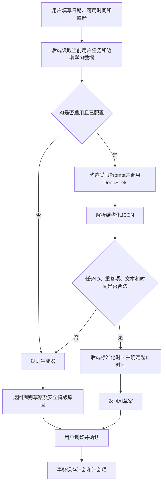

# AI Study Planner Agent

一个面向个人学习管理的前后端分离项目。用户可以维护科目、目标、任务和学习记录，查看统计数据，并使用确定性规则或 DeepSeek AI 生成今日学习计划。AI 结果会经过后端业务校验和安全修正；模型不可用或结果不合法时，系统自动降级为规则计划。

## 当前功能

- 用户注册、登录、退出及登录状态恢复
- 学习科目、学习目标和学习任务管理
- 今日待办、逾期任务及即将截止任务
- 学习记录、时长校验、日期筛选和重叠检查
- 学习概览、每日趋势和科目时长分布
- 规则学习规划与 DeepSeek AI 学习规划
- AI 失败自动降级，降级草案仍可编辑和保存
- 草案排序、时长调整、恢复、确认和计划执行跟踪
- 当前用户数据隔离和 Sa-Token 接口鉴权

## 技术栈

| 层级 | 技术 |
|---|---|
| 前端 | Vue 3、TypeScript、Vite、Element Plus、Pinia、ECharts |
| 后端 | Java 17、Spring Boot 3.5、Spring AI 1.1.8、MyBatis-Plus、Sa-Token、Flyway |
| 数据 | MySQL 8、Redis 7 |
| AI | DeepSeek OpenAI 兼容接口，默认 `deepseek-v4-flash`，非思考模式 |
| 工程化 | Maven、npm、Nginx、Docker Compose、GitHub Actions |

## 系统架构



浏览器只访问前端和后端业务接口。前端不会直接连接 DeepSeek；生产环境由 Nginx 将 `/api/` 请求代理到 Spring Boot。

## AI 规划流程



AI 只负责选择候选任务、建议时长和理由。任务归属、状态、重复项、时间范围和总时长均由后端校验；正数时长偏差会被确定性修正，非法任务或无效结构会触发规则降级。

## 安全设计

- DeepSeek API Key 只从后端环境变量 `DEEPSEEK_API_KEY` 读取。
- Key 不写入 Git、前端构建产物、接口响应或普通日志。
- 日志不记录完整 Prompt、供应商原始响应或用户学习内容。
- 所有业务查询和修改均限制当前登录用户。
- AI 输出不会直接写库，必须通过后端校验并由用户确认。
- AI 关闭、超时、限流、服务异常或输出非法时自动降级为规则计划。
- CI 默认设置 `AI_ENABLED=false`，不会调用真实供应商。

## 本地开发

### 环境要求

- JDK 17
- Maven 3.9+
- Node.js 20+
- MySQL 8
- Redis 7（Windows 可使用 Memurai）

数据库名称为 `ai_study_planner`。可以复制后端示例配置：

```powershell
Copy-Item backend/src/main/resources/application-local.yml.example backend/application-local.yml
```

也可以直接设置环境变量，然后启动后端：

```powershell
$env:DB_URL='jdbc:mysql://localhost:3306/ai_study_planner?useUnicode=true&characterEncoding=utf8&serverTimezone=Asia%2FShanghai&allowPublicKeyRetrieval=true&useSSL=false'
$env:DB_USERNAME='root'
$env:DB_PASSWORD='your-local-password'
$env:REDIS_HOST='localhost'
$env:AI_ENABLED='false'
cd backend
mvn spring-boot:run
```

Flyway 会在后端启动时创建或校验数据库结构。另开终端启动前端：

```powershell
cd frontend
npm install
npm run dev
```

本地访问地址为 `http://localhost:5173`，后端默认为 `http://localhost:8080`。

如需在本地启用 AI，仅在服务端环境中设置：

```powershell
$env:AI_ENABLED='true'
$env:DEEPSEEK_API_KEY='your-real-key'
```

不要将真实 Key 写入任何配置文件或提交到仓库。

## Docker Compose 启动

复制示例环境文件并修改示例密码：

```powershell
Copy-Item .env.example .env
docker compose up -d --build
```

Compose 会启动 MySQL、Redis、Spring Boot 和 Vue/Nginx，数据分别保存在命名 Volume 中。默认访问：

- 前端：`http://localhost:5173`
- 后端调试：`http://localhost:8080`

默认 `AI_ENABLED=false`。需要 AI 时，在本地 `.env` 中填写：

```dotenv
AI_ENABLED=true
DEEPSEEK_API_KEY=your-real-key
```

`.env` 已被 Git 忽略，`.env.example` 只包含安全示例值。

## 环境变量

| 变量 | 默认值/示例 | 说明 |
|---|---|---|
| `DB_URL` | 本地 MySQL URL | JDBC连接地址；Compose固定连接`mysql`服务 |
| `DB_USERNAME` | `ai_study` | 数据库业务用户 |
| `DB_PASSWORD` | 示例值，必须修改 | 数据库业务密码 |
| `MYSQL_ROOT_PASSWORD` | 示例值，必须修改 | Compose初始化MySQL使用 |
| `REDIS_HOST` | `localhost` | Compose中为`redis` |
| `REDIS_PORT` | `6379` | Redis端口 |
| `AI_ENABLED` | `false` | 是否启用真实AI调用 |
| `DEEPSEEK_API_KEY` | 空 | 仅后端读取的供应商Key |
| `DEEPSEEK_BASE_URL` | `https://api.deepseek.com` | DeepSeek兼容接口地址 |
| `DEEPSEEK_MODEL` | `deepseek-v4-flash` | AI规划模型 |
| `APP_CORS_ALLOWED_ORIGIN` | `http://localhost:5173` | 允许的前端来源 |
| `FRONTEND_PORT` | `5173` | Compose前端宿主机端口 |
| `BACKEND_PORT` | `8080` | Compose后端调试端口 |

## 接口概览

所有接口统一以 `/api/v1` 为前缀，除注册和登录外均需要 Sa-Token。

| 模块 | 主要接口 |
|---|---|
| 认证 | `POST /auth/register`、`POST /auth/login`、`POST /auth/logout`、`GET /auth/me` |
| 科目 | `/subjects` 增删改查 |
| 目标 | `/goals` 增删改查和状态管理 |
| 任务 | `/tasks` 增删改查、今日待办、临期查询和状态管理 |
| 学习记录 | `/records` 分页、筛选、创建、更新和删除 |
| 数据统计 | `/statistics/summary`、`/daily-trend`、`/subject-distribution` |
| 规则草案 | `POST /plans/draft` |
| AI草案 | `POST /ai/plans/draft` |
| 计划 | `POST /plans/confirm`、`GET /plans`、详情及状态管理 |

AI 与规则草案都复用 `POST /api/v1/plans/confirm` 保存，不存在第二套确认流程。

## 项目结构

```text
AIStudyPlannerAgent/
├─ .github/workflows/ci.yml
├─ backend/
│  ├─ src/main/java/com/yhk/aistudyplanner/
│  ├─ src/main/resources/
│  ├─ src/test/
│  ├─ Dockerfile
│  └─ pom.xml
├─ frontend/
│  ├─ src/
│  ├─ Dockerfile
│  ├─ nginx.conf
│  └─ package.json
├─ docker-compose.yml
├─ .env.example
└─ README.md
```

## 测试与持续集成

本地验证命令：

```powershell
cd backend
mvn clean test
mvn clean package

cd ../frontend
npm ci
npm run build
```

GitHub Actions 在推送到 `main` 或向 `main` 创建 Pull Request 时并行执行：

- Java 17 后端全量测试和跳过测试的打包检查
- Node.js 20 前端依赖安装、TypeScript检查和Vite生产构建

CI使用Maven/npm缓存，并保持AI关闭，不需要也不会读取真实DeepSeek Key。

## 已知限制

- AI调用为非流式响应，尚未实现SSE。
- 尚未实现Agent工具调用、Function Calling和多Agent。
- 尚未实现RAG、向量数据库、MCP和AI会话历史。
- 尚未支持多模型切换或用户自定义API Key。
- AI/规则来源未持久化，历史计划不会显示或推断来源。

## 后续规划

- 在业务稳定后评估SSE流式反馈。
- 按实际需求评估受控Agent工具调用和会话历史。
- 增加更完整的端到端测试与部署监控。
