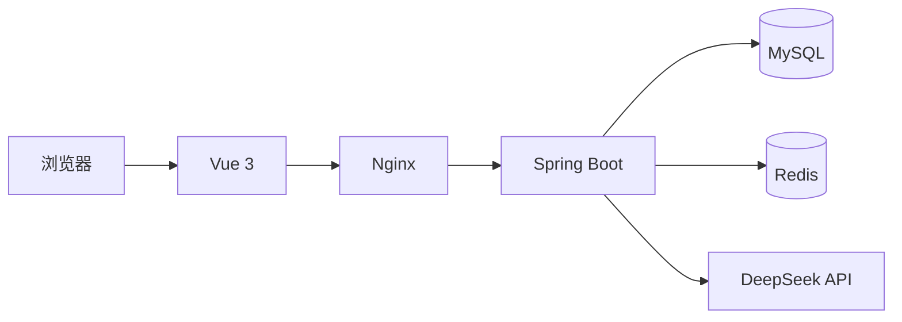
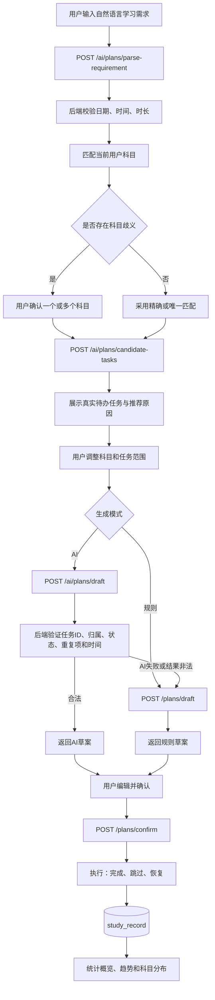

# AI Study Planner Agent

一个面向个人学习管理的全栈项目，将自然语言学习意图转化为可执行计划，并串联真实任务、计划执行、学习记录与统计分析。系统不是让模型自由操作数据库：AI 只负责结构化理解和规划建议，候选数据、用户归属、任务状态、时间边界及模型输出均由后端校验，所有计划必须由用户确认后才能保存。

完整闭环：

```text
自然语言学习需求 → AI 结构化解析 → 科目匹配与歧义确认 → 当前用户真实任务候选
→ 用户调整学习范围 → AI/规则计划生成 → 草案校验与确认 → 完成/跳过/恢复
→ 真实学习记录 → 学习统计
```

## 当前功能

- 注册、登录、退出、Token 保存与刷新后的登录状态恢复
- Sa-Token 鉴权、CORS 预检处理和当前用户数据隔离
- 学习科目、学习目标和学习任务管理
- 今日待办、临期任务和逾期未完成任务展示
- 学习记录增删改查、实际时间校验、重叠检查和后端时长计算
- 学习总览、每日趋势和科目学习时长分布
- 自然语言学习需求解析，识别日期、开始时间、时长和学习偏好
- 科目精确/唯一匹配、歧义识别、多科目确认和未匹配提示
- 基于当前用户 TODO、IN_PROGRESS 状态任务的真实候选集
- 用户调整科目与任务范围，生成请求受 `selectedSubjectIds`、`selectedTaskIds` 限制
- 无匹配内容时，经用户确认快速创建或复用科目并创建真实任务
- DeepSeek AI 学习计划、确定性规则计划及 AI 失败自动降级
- 草案排序、时长调整、恢复生成结果和确认保存
- 计划执行：完成、跳过、恢复待执行，以及整体完成/部分完成/全部跳过状态
- 完成计划项时记录实际开始时间、结束时间、学习反馈，并可选择联动完成原任务
- 实际学习时长写入学习记录并实时进入统计

## 技术栈

| 层级 | 技术 |
|---|---|
| 前端 | Vue 3、TypeScript、Vite、Element Plus、Pinia、Vue Router、ECharts |
| 后端 | Java 17、Spring Boot 3.5、Spring AI 1.1.8、MyBatis-Plus、Sa-Token、Flyway |
| 数据 | MySQL 8、Redis 7 |
| AI | DeepSeek OpenAI 兼容接口，默认 `deepseek-v4-flash`，非思考模式 |
| 工程化 | Maven、npm、Nginx、Docker Compose、GitHub Actions |

## 系统架构


```mermaid
flowchart LR
    U[浏览器] --> V[Vue 3]
    V --> N[Nginx]
    N --> B[Spring Boot]
    B --> M[(MySQL)]
    B --> R[(Redis)]
    B --> D[DeepSeek API]
```

前端只调用后端业务接口，不持有或直连 DeepSeek API Key。Redis 用于应用基础状态，业务数据与已确认计划持久化到 MySQL，Flyway 负责结构版本管理。

## AI 学习规划流程


```mermaid
flowchart TD
    A[用户输入自然语言学习需求] --> B[POST /ai/plans/parse-requirement]
    B --> C[后端校验日期、时间、时长]
    C --> D[匹配当前用户科目]
    D --> E{是否存在科目歧义}
    E -- 是 --> F[用户确认一个或多个科目]
    E -- 否 --> G[采用精确或唯一匹配]
    F --> H[POST /ai/plans/candidate-tasks]
    G --> H
    H --> I[展示真实待办任务与推荐原因]
    I --> J[用户调整科目和任务范围]
    J --> K{生成模式}
    K -- AI --> L[POST /ai/plans/draft]
    K -- 规则 --> M[POST /plans/draft]
    L --> N[后端验证任务ID、归属、状态、重复项和时间]
    N -- AI失败或结果非法 --> M
    N -- 合法 --> O[返回AI草案]
    M --> P[返回规则草案]
    O --> Q[用户编辑并确认]
    P --> Q
    Q --> R[POST /plans/confirm]
    R --> S[执行：完成、跳过、恢复]
    S --> T[(study_record)]
    T --> U[统计概览、趋势和科目分布]
```

AI 不能创建、修改或完成业务数据。快速创建任务也不是 AI 写库，而是用户确认后由普通后端 Service 在事务中执行。

## 计划时长与真实时长

- `plannedMinutes` 是生成计划时确定的计划时长。
- `actualMinutes` 是完成计划项后产生的真实学习时长。
- `actualMinutes` 的唯一数据来源是 `study_record.duration_minutes`。
- `study_record.plan_item_id` 唯一关联产生该记录的计划项，防止重复完成产生重复记录。
- 计划详情通过关联学习记录返回真实时长和反馈；历史已完成项目若没有关联记录，`actualMinutes` 为 `null`。
- 系统不会使用 `plannedMinutes` 回退或冒充 `actualMinutes`。

## 安全与可靠性

- DeepSeek API Key 只从后端环境变量 `DEEPSEEK_API_KEY` 读取，不进入 Git、前端构建或接口响应。
- 日志不记录完整 Prompt、供应商原始响应、API Key 或用户学习内容。
- Controller 不接受可伪造的 `userId`；Service 和 Mapper 始终限制当前登录用户。
- 候选任务只允许当前用户的 TODO、IN_PROGRESS 任务，并受本次计划日期和用户选择范围约束。
- AI 输出经过 JSON 解析、任务白名单、重复项、文本、单项时长、总时长及跨日校验。
- AI 关闭、未配置、超时、限流、服务异常或输出非法时自动降级为规则计划。
- 计划项完成、学习记录创建、可选任务完成及计划状态重算位于同一事务中。
- `plan_item_id` 唯一关系保证重复完成不会重复增加统计时长。

## 接口概览

所有接口统一以 `/api/v1` 为前缀。注册、登录公开，其余接口需要 Sa-Token 登录状态。

| 模块 | 方法与路径 | 用途 |
|---|---|---|
| 认证 | `POST /auth/register`、`POST /auth/login`、`POST /auth/logout`、`GET /auth/me` | 注册、登录、退出和状态恢复 |
| 科目 | `GET/POST /subjects`、`GET/PUT/DELETE /subjects/{id}` | 科目查询与维护 |
| 目标 | `GET/POST /goals`、`GET/PUT/DELETE /goals/{id}`、`PATCH /goals/{id}/status` | 目标查询、维护和状态更新 |
| 任务 | `GET/POST /tasks`、`GET/PUT/DELETE /tasks/{id}`、`PATCH /tasks/{id}/status` | 任务查询、维护和状态更新 |
| 今日与临期 | `GET /tasks/today`、`GET /tasks/upcoming` | 今日待办、逾期和临期任务 |
| 学习记录 | `GET/POST /records`、`GET/PUT/DELETE /records/{id}` | 记录分页筛选与维护 |
| 统计 | `GET /statistics/summary`、`GET /statistics/daily-trend`、`GET /statistics/subject-distribution` | 汇总、趋势和科目分布 |
| 自然语言解析 | `POST /ai/plans/parse-requirement` | 解析计划日期、时间、时长、主题和偏好 |
| 候选任务 | `POST /ai/plans/candidate-tasks` | 按确认科目返回当前用户真实待办任务 |
| 快速创建 | `POST /ai/plans/quick-create-task` | 用户确认后复用/创建科目并创建任务 |
| AI 草案 | `POST /ai/plans/draft` | 使用选中任务生成 AI 草案，失败时自动降级 |
| 规则草案 | `POST /plans/draft` | 使用选中任务生成确定性规则草案 |
| 计划确认 | `POST /plans/confirm` | 事务保存用户确认的草案 |
| 计划查询 | `GET /plans`、`GET /plans/{id}` | 历史计划分页与详情 |
| 计划状态 | `PATCH /plans/{id}/status` | 更新整份计划状态 |
| 完成计划项 | `POST /plans/{planId}/items/{itemId}/complete` | 保存实际时间、反馈和学习记录 |
| 跳过/恢复 | `PATCH /plans/{planId}/items/{itemId}/status` | 跳过或恢复计划项 |

AI 与规则草案使用同一个确认接口，不存在绕过业务校验的第二套保存流程。

## Flyway 数据库迁移

当前迁移版本：

- `V1__create_mvp_tables.sql`：MVP 用户、科目、目标、任务、记录和计划基础表。
- `V2__add_plan_execution_tracking.sql`：计划执行状态、任务恢复信息及学习记录来源关联。
- `V3__complete_plan_execution_tracking.sql`：移除计划项中的重复实际时长/反馈字段，确立 `study_record` 为唯一真实执行数据源。

已经在环境中执行过的 Flyway migration 必须保持不可变，否则会产生 checksum mismatch。后续 Schema 变化只能增加新的版本迁移，不能修改 V1、V2 或 V3。

## 本地开发

### 环境要求

- JDK 17
- Maven 3.9+
- Node.js 20+
- MySQL 8
- Redis 7（Windows 可使用 Memurai）

创建数据库 `ai_study_planner`。可复制本地配置示例：

```powershell
Copy-Item backend/src/main/resources/application-local.yml.example backend/application-local.yml
```

也可以设置环境变量后启动后端：

```powershell
$env:DB_URL='jdbc:mysql://localhost:3306/ai_study_planner?useUnicode=true&characterEncoding=utf8&serverTimezone=Asia%2FShanghai&allowPublicKeyRetrieval=true&useSSL=false'
$env:DB_USERNAME='root'
$env:DB_PASSWORD='your-local-password'
$env:REDIS_HOST='localhost'
$env:REDIS_PORT='6379'
$env:AI_ENABLED='false'
cd backend
mvn spring-boot:run
```

Flyway 会在启动时执行或校验迁移。另开终端启动前端：

```powershell
cd frontend
npm ci
npm run dev
```

访问 `http://localhost:5173`。开发服务器固定使用 5173；若端口被占用会直接退出，避免自动切换端口后与后端 CORS 配置不一致。

如需启用 AI，仅在后端运行环境中设置：

```powershell
$env:AI_ENABLED='true'
$env:DEEPSEEK_API_KEY='your-real-key'
```

不要把真实 Key 写入配置文件或提交到仓库。

## Docker Compose

```powershell
Copy-Item .env.example .env
docker compose up -d --build
```

Compose 启动 MySQL 8、Redis 7、Spring Boot 和 Vue/Nginx。MySQL 与 Redis 使用命名 Volume，Flyway 由后端启动时执行。

- 前端：`http://localhost:5173`
- 后端调试：`http://localhost:8080`
- 默认 `AI_ENABLED=false`

需要 AI 时，仅在本地 `.env` 设置 `AI_ENABLED=true` 和 `DEEPSEEK_API_KEY`；`.env` 已被忽略，`.env.example` 保持可跟踪。

## 环境变量

| 变量 | 默认值/示例 | 说明 |
|---|---|---|
| `DB_URL` | 本地 MySQL JDBC URL | Compose 中连接 `mysql` 服务 |
| `DB_USERNAME` | `ai_study` | 数据库业务用户 |
| `DB_PASSWORD` | 示例值，必须修改 | 数据库业务密码 |
| `MYSQL_ROOT_PASSWORD` | 示例值，必须修改 | Compose 初始化 MySQL |
| `REDIS_HOST` | `localhost` | Compose 中为 `redis` |
| `REDIS_PORT` | `6379` | Redis端口 |
| `AI_ENABLED` | `false` | 是否启用真实 AI 调用 |
| `DEEPSEEK_API_KEY` | 空 | 仅后端读取的供应商 Key |
| `DEEPSEEK_BASE_URL` | `https://api.deepseek.com` | OpenAI 兼容接口地址 |
| `DEEPSEEK_MODEL` | `deepseek-v4-flash` | 当前规划模型 |
| `APP_CORS_ALLOWED_ORIGIN` | `http://localhost:5173` | 后端允许的前端来源 |
| `FRONTEND_PORT` | `5173` | Compose 前端宿主机端口 |
| `BACKEND_PORT` | `8080` | Compose 后端调试端口 |

## 项目结构

```text
AIStudyPlannerAgent/
├─ .github/workflows/ci.yml
├─ backend/
│  ├─ src/main/java/com/yhk/aistudyplanner/
│  ├─ src/main/resources/db/migration/
│  ├─ src/test/
│  ├─ Dockerfile
│  └─ pom.xml
├─ frontend/
│  ├─ src/
│  ├─ Dockerfile
│  ├─ nginx.conf
│  └─ package.json
├─ docker-compose.yml
├─ .env.example
└─ README.md
```

## 测试与 CI

本地完整验证：

```powershell
cd backend
mvn clean test
mvn package -DskipTests

cd ../frontend
npm ci
npm run test:progress
npm run build
```

GitHub Actions 在 push 到 `main` 和针对 `main` 的 Pull Request 上并行运行：

- 后端：Temurin Java 17、Maven 缓存、`mvn -B clean test`、`mvn -B package -DskipTests`。
- 前端：Node.js 20、npm 缓存、`npm ci`、`npm run test:progress`、`npm run build`。
- CI 设置 `AI_ENABLED=false`，不配置或调用真实 DeepSeek。

## 已知限制

- AI 调用为非流式响应，未实现 SSE。
- 当前是受控的规划流程，未实现 Agent 工具调用或 Function Calling。
- 未实现 RAG、向量数据库、MCP、多 Agent 和 AI 会话历史。
- 未支持多模型动态切换或用户自定义 API Key。
- AI/规则生成来源没有持久化到历史计划。
- 当前业务时间统一使用 Asia/Shanghai，尚未提供用户级时区设置。

## 后续方向

- 增加浏览器端端到端测试和发布监控。
- 根据真实使用需求评估 SSE 和受控工具调用。
- 在不削弱数据隔离与确认机制的前提下扩展部署能力。
